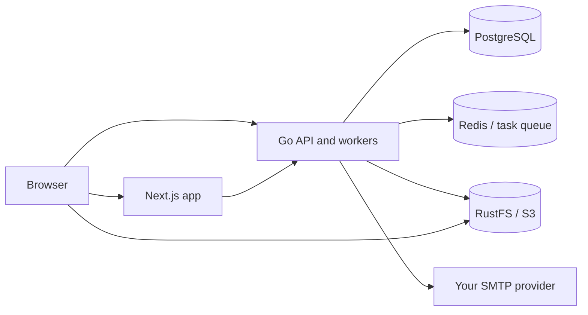

<p align="center">
  
</p>

<p align="center">
  <a href="https://xem.email">Website</a> ·
  <a href="devops/swarm/README.md">Self-host</a> ·
  <a href="docs">Documentation</a> ·
  <a href="https://github.com/mailxem/mail/issues">Issues</a>
</p>

<p align="center">
  <a href="LICENSE"></a>
  
  
  
</p>

**Xem** (formerly Posthoot) is an open-source email platform for teams that want control over their delivery infrastructure. Bring your SMTP provider, create campaigns and templates, manage audiences, and build multi-step automations through a web app or API.

## Start your own Xem

On a Linux host with **Docker Engine, Git, Python 3, and OpenSSL**, run:

```bash
curl -fsSL https://raw.githubusercontent.com/mailxem/mail/undefined/scripts/install.sh | bash
```

The wizard asks for the app, API, and storage addresses. It builds the app and backend from the same repository revision, generates credentials, initializes Swarm when needed, and starts **Next.js + Go + PostgreSQL + Redis + RustFS**. No cloud storage account is required.

**Basic runtime target: 2 CPU cores, 2 GB RAM, and 20 GB free disk** for a small installation. Source builds can need additional memory or swap, especially while building the Next.js app. Allow room for build caches and growing data; scale with your workload. See the [requirements](devops/swarm/README.md#requirements) before installing.

Use a host IP or DNS name reachable from both browsers and containers. The default ports are **3000** (app), **9001** (API), and **9000** (object storage). HTTP is intended for a trusted local network; configure HTTPS before exposing the installation publicly.

Open the printed `/auth/register` URL, create your account, and connect your own SMTP provider. Managed SES sending, hosted billing, Google OAuth, and the AI assistant require additional configuration and are not provisioned by this starter.


Prefer to inspect the script first?

```bash
curl -fsSLo install-xem.sh https://raw.githubusercontent.com/mailxem/mail/undefined/scripts/install.sh
less install-xem.sh
bash install-xem.sh
```

See the **[Swarm guide](devops/swarm/README.md)** for unattended setup, HTTPS, updates, backups, troubleshooting, and removal. This is a single-node starter, not a high-availability deployment.

## What you can build

| Capability | Use it for |
| --- | --- |
| Campaigns and templates | Compose email, reuse designs, and send through your chosen provider. |
| Audiences | Organize contacts with lists, tags, segments, and custom data. |
| Automations | Combine email, conditions, waits, splits, webhooks, and subscriber updates. |
| Delivery APIs | Integrate email into your product using REST, Go, or TypeScript. |
| Reporting | Inspect campaign activity and delivery outcomes. |

## How the pieces fit



## Clone and develop

```bash
git clone https://github.com/mailxem/mail.git
cd mail
make help

# Run the same Swarm installer from the checkout:
python3 devops/swarm/install.py
```

For frontend development, point the app at a running backend and follow [client setup](docs/client/setup.mdx). Backend configuration and API documentation live in [`server/`](server) and [`docs/`](docs). Components keep their own dependency files; component CI and releases live together in `.github/workflows/`. A single PR can change both sides of an API.

| Component | Directory | Original repository / history |
| --- | --- | --- |
| Go API and workers | `server/` | [xem.go](https://github.com/mailxem/xem.go) |
| Next.js application | `client/` | [xem-app.ts](https://github.com/mailxem/xem-app.ts) |
| Deployment infrastructure | `devops/` | [devops](https://github.com/mailxem/devops) |
| MCP integration | `mcp/` | [mcp](https://github.com/mailxem/mcp) |
| Payments | `payments.go/` | [payments.go](https://github.com/mailxem/payments.go) |
| TypeScript SDK | `sdk/` | [sdk](https://github.com/mailxem/sdk) |
| Go SDK | `sdk-go/` | [sdk-go](https://github.com/mailxem/sdk-go) |
| Marketing website | `website/` | [xem-website](https://github.com/mailxem/xem-website) |

This is a **monorepo**: all eight components above are normal directories. No submodule initialization or second repository checkout is required. The starter deploys the app, backend, and their data services.

### CI and releases

- Frontend changes run TypeScript, Jest, and Next.js build checks.
- Backend changes run Go vet, race tests, builds, and the relevant PostgreSQL/SMTP integration checks.
- Changes to either side run the full Docker Swarm smoke test.
- Default-branch changes publish the affected component's amd64/arm64 images independently, then assemble the combined image and create a component-scoped release.
- Website, infrastructure, MCP, payments, and Go SDK workflows also run from the root, with checks scoped to their component paths.
- Images keep `theboringhumane/xemapp` and `theboringhumane/xemgo`; Git tags use `frontend-v*` and `backend-v*` to avoid collisions.

See the [migration and CI guide](migration/README.md) for source provenance, configuration, and the cutover from the original repositories.

## Contribute

Report bugs with reproduction steps, open a focused PR, or improve the docs. Keep credentials and local `.env` files out of commits. Make component changes directly in this repository and include related frontend/backend updates in the same PR.

Xem's code is [MIT licensed](LICENSE). Bundled third-party services retain their own licenses, including RustFS's Apache-2.0 license.
