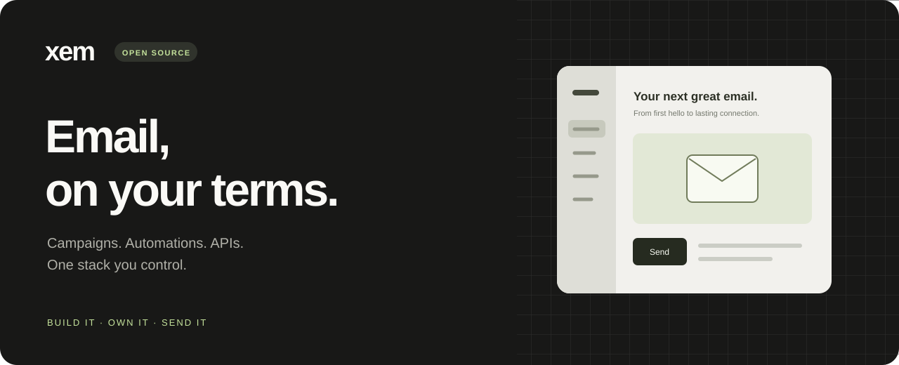
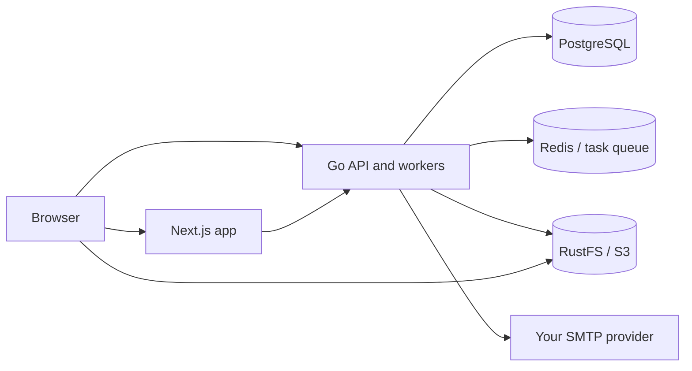

<p align="center">
  
</p>

<p align="center">
  <a href="https://xem.email">Website</a> ·
  <a href="deploy/swarm/README.md">Self-host</a> ·
  <a href="docs">Documentation</a> ·
  <a href="https://github.com/mailxem/mail/issues">Issues</a>
</p>

<p align="center">
  <a href="LICENSE"></a>
  
  
  
</p>

**Xem** (formerly Posthoot) is an open-source email platform for teams that want control over their delivery infrastructure. Bring your SMTP provider, create campaigns and templates, manage audiences, and build multi-step automations through a web app or API.

## Start your own Xem

On a Linux host with **Docker Engine, Git, Python 3, and OpenSSL**, run:

```bash
curl -fsSL https://raw.githubusercontent.com/mailxem/mail/undefined/scripts/install.sh | bash
```

The wizard asks for the app, API, and storage addresses. It builds the pinned app and backend, generates credentials, initializes Swarm when needed, and starts **Next.js + Go + PostgreSQL + Redis + RustFS**. No cloud storage account is required. Allow time and disk space for the first build; a practical starting point is 4 CPU cores, 8 GB RAM, and 20 GB free disk.

Use a host IP or DNS name reachable from both browsers and containers. The default ports are **3000** (app), **9001** (API), and **9000** (object storage). HTTP is intended for a trusted local network; configure HTTPS before exposing the installation publicly.

Open the printed `/auth/register` URL, create your account, and connect your own SMTP provider. Managed SES sending, hosted billing, Google OAuth, and the AI assistant require additional configuration and are not provisioned by this starter.

> The installer URL becomes available after this change is merged into `undefined`, the repository's current default branch. Until then, use the PR branch commands in the [self-hosting guide](deploy/swarm/README.md).

Prefer to inspect the script first?

```bash
curl -fsSLo install-xem.sh https://raw.githubusercontent.com/mailxem/mail/undefined/scripts/install.sh
less install-xem.sh
bash install-xem.sh
```

See the **[Swarm guide](deploy/swarm/README.md)** for unattended setup, HTTPS, updates, backups, troubleshooting, and removal. This is a single-node starter, not a high-availability deployment.

## What you can build

| Capability | Use it for |
| --- | --- |
| Campaigns and templates | Compose email, reuse designs, and send through your chosen provider. |
| Audiences | Organize contacts with lists, tags, segments, and custom data. |
| Automations | Combine email, conditions, waits, splits, webhooks, and subscriber updates. |
| Delivery APIs | Integrate email into your product using REST, Go, or TypeScript. |
| Reporting | Inspect campaign activity and delivery outcomes. |

## How the pieces fit



## Clone and develop

```bash
git clone --recurse-submodules https://github.com/mailxem/mail.git
cd mail
# Or initialize an existing clone at this repository's pinned revisions:
git submodule update --init --recursive

# Run the same Swarm installer from the checkout:
python3 deploy/swarm/install.py
```

For frontend development, point the app at a running backend and follow [client setup](docs/client/setup.mdx). Backend configuration and API documentation live in [`server/`](server) and [`docs/`](docs). Each component has its own build and contribution workflow.

| Component | Directory | Repository |
| --- | --- | --- |
| Go API and workers | `server/` | [xem.go](https://github.com/mailxem/xem.go) |
| Next.js application | `client/` | [xem-app.ts](https://github.com/mailxem/xem-app.ts) |
| Deployment infrastructure | `devops/` | [devops](https://github.com/mailxem/devops) |
| MCP integration | `mcp/` | [mcp](https://github.com/mailxem/mcp) |
| Payments | `payments.go/` | [payments.go](https://github.com/mailxem/payments.go) |
| TypeScript SDK | `sdk/` | [sdk](https://github.com/mailxem/sdk) |
| Go SDK | `sdk-go/` | [sdk-go](https://github.com/mailxem/sdk-go) |
| Marketing website | `website/` | [xem-website](https://github.com/mailxem/xem-website) |

Submodules are pinned to specific commits so releases can be reproduced. `git submodule update --remote` deliberately changes those revisions; maintainers should review and commit the updated pins together. The starter deploys only the app, backend, and their data services.

## Contribute

Report bugs with reproduction steps, open a focused PR, or improve the docs. Keep credentials and local `.env` files out of commits. Component changes belong in the corresponding repository; update the parent pin after the component commit is published.

Xem's code is [MIT licensed](LICENSE). Bundled third-party services retain their own licenses, including RustFS's Apache-2.0 license.
