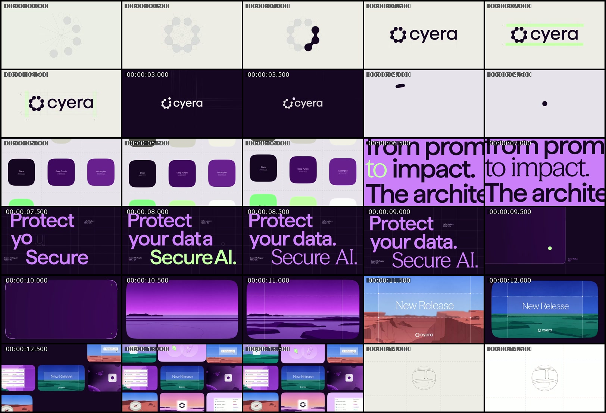
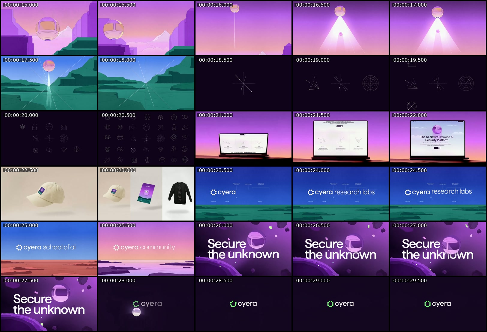

# Reference audit

Source: `Motionimo_-_Cyera_Brand_Video_by_Ido_Sapir_amp_Team_6khr40.mp4`, supplied locally by the user. These images depict the source film, not the proposed Xem animation.

- `source.mp4`: local copy for reference playback (git-ignored).
- `frames/0001.jpg` through `frames/0901.jpg`: all decoded frames (git-ignored), one-based filenames.
- `frame-manifest.csv`: one record per source frame, exact PTS, scene assignment, and the active proposed choreography cue. Cue text describes the plan, not a measured pixel transform.
- `scene-cuts.csv`: 28 scene intervals, with end-exclusive frame indices.
- `timestamps.json`: source timestamps reported by ffprobe.
- `scene-detection.log`: automatic cut candidates used as support; the final plan was checked visually.
- `contact-01.jpg`, `contact-02.jpg`: readable half-second overviews. Use the all-frame sheets for exact indexing.
- `all-frames-01.jpg` through `all-frames-12.jpg`: every decoded frame, 80 tiles per sheet, labelled by zero-based frame number. Blank cells at the end are unused, not black source frames.

## Overview

## All-frame sheets

- [Frames 0–79](all-frames-01.jpg)
- [Frames 80–159](all-frames-02.jpg)
- [Frames 160–239](all-frames-03.jpg)
- [Frames 240–319](all-frames-04.jpg)
- [Frames 320–399](all-frames-05.jpg)
- [Frames 400–479](all-frames-06.jpg)
- [Frames 480–559](all-frames-07.jpg)
- [Frames 560–639](all-frames-08.jpg)
- [Frames 640–719](all-frames-09.jpg)
- [Frames 720–799](all-frames-10.jpg)
- [Frames 800–879](all-frames-11.jpg)
- [Frames 880–900](all-frames-12.jpg)
